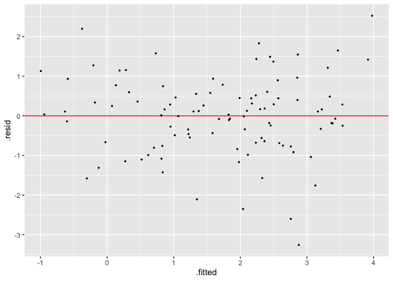
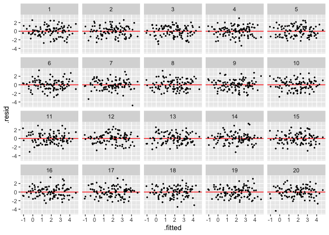

<!-- README.md is generated from README.Rmd. Please edit that file -->

# visage

<!-- badges: start -->
<!-- badges: end -->

The goal of visage is to provide an lightweight OOP system and a set of
tools for running visual inference experiments.

## Installation

And the development version from [GitHub](https://github.com/) with:

``` r
# install.packages("devtools")
devtools::install_github("TengMCing/visage")
```

``` r
library(visage)
```

## Usage of visual inference cubic linear model class

### Define a model

A visual inference cubic linear model is defined as

``` r
CUBIC_MODEL$formula
#> y ~ 1 + (2 - c) * x + c * z + a * (((2 - c) * x)^2 + (c * z)^2) + 
#>     b * (((2 - c) * x)^3 + (c * z)^3) + e
```

where `x` and `z` are random variables, `a`, `b` and `c` are parameters
and `e` is the random error term.

To define the model, `cubic_model()` needs to be used. `x` and `z` by
default are assumed to follow a uniform distribution and `e` by default
is assumed to follow a normal distribution with standard deviation
equals to `sigma`.

``` r
mod <- cubic_model(a = 1, b = 1, c = 1, sigma = 1)
mod
#> 
#> ── <CUBIC_MODEL object>
#> y = 1 + (2 - c) * x + c * z + a * (((2 - c) * x)^2 + (c * z)^2) + b * (((2 - c) * x)^3 + (c * z)^3) + e
#>  - x: <RAND_UNIFORM object>
#>    [a: -1, b: 1]
#>  - z: <RAND_UNIFORM object>
#>    [a: -1, b: 1]
#>  - e: <RAND_NORMAL object>
#>    [mu: 0, sigma: 1]
#>  - a: 1
#>  - b: 1
#>  - c: 1
#>  - sigma: 1
```

To specify the different distribution for `x` and `z` and `e`, you can
follow this example:

``` r
# Normal distribution
x <- rand_normal(mu = 0, sigma = 1)

# Uniform distribution
z <- rand_uniform(a = -1, b = 1)

# Log-normal distribution
e <- rand_lognormal(mu = 0, sigma = 10)

mod2 <- cubic_model(a = 1, b = 1, c = 1, x = x, z = z, e = e)

mod2
#> 
#> ── <CUBIC_MODEL object>
#> y = 1 + (2 - c) * x + c * z + a * (((2 - c) * x)^2 + (c * z)^2) + b * (((2 - c) * x)^3 + (c * z)^3) + e
#>  - x: <RAND_NORMAL object>
#>    [mu: 0, sigma: 1]
#>  - z: <RAND_UNIFORM object>
#>    [a: -1, b: 1]
#>  - e: <RAND_LOGNORMAL object>
#>    [mu: 0, sigma: 10]
#>  - a: 1
#>  - b: 1
#>  - c: 1
#>  - sigma: 1
```

### Generate random values from the model

To generate random values from the model, method `gen()` needs to be
used. It will return a data frame containing values of `y`, `x`, `z`,
`e`, `.resid` and `.fitted`.

``` r
mod$gen(n = 5)
#>             y          x          z           e      .resid    .fitted
#> 1  0.77326001  0.3865196 -0.8370314 -0.09755001  0.18516642  0.5880936
#> 2  0.02630913 -0.1848605 -0.9409254  0.07193774  0.43672718 -0.4104180
#> 3  0.91407443  0.3033847 -0.3503976 -0.23863639 -0.94852200  1.8625964
#> 4  4.84548456  0.5958751  0.4378697  1.96941426  0.39170758  4.4537770
#> 5 -1.48613341 -0.9760644 -0.9533160 -0.62198349 -0.06507917 -1.4210542
```

Residuals and fitted values are obtained by fitting the following null
model:

``` r
CUBIC_MODEL$null_formula
#> y ~ x + z
```

### Make a residual plot

``` r
mod$plot(mod$gen(100), "resid")
```



### Generate data for a lineup

``` r
mod$gen_lineup(n = 10, k = 2)
#>             y           x           z          e       .resid    .fitted
#> 1   2.5461768  0.91925441  0.10400979 -1.1108557 -0.546031254  3.0922080
#> 2   0.8031114 -0.82298904 -0.82878623  1.2173908  0.987134423 -0.1840230
#> 3   0.6969192  0.01936956  0.08552741 -0.4163008 -1.438297922  2.1352171
#> 4   6.1341432  0.91487922  0.97701646 -0.2476972  1.661113435  4.4730298
#> 5   3.2245856  0.43522217  0.78913099 -0.3857664 -0.455834973  3.6804206
#> 6   1.0922849 -0.12745730 -0.03447324  0.2388932 -0.701149973  1.7934349
#> 7   0.9791615 -0.90545265 -0.23439541  0.9994322  0.304983552  0.6741779
#> 8   0.3013803 -0.64092877 -0.56501707  0.2209576 -0.120839189  0.4222195
#> 9   0.9660950  0.43942123 -0.95398967  0.1608503  0.047419545  0.9186754
#> 10  1.2096456  0.41822938 -0.92165278  0.3984467  0.261502356  0.9481433
#> 11  3.0948706  0.91925441  0.10400979 -1.1108557  0.002662606  3.0922080
#> 12 -1.3144387 -0.82298904 -0.82878623  1.2173908 -1.130415695 -0.1840230
#> 13  1.0091269  0.01936956  0.08552741 -0.4163008 -1.126090258  2.1352171
#> 14  4.7191487  0.91487922  0.97701646 -0.2476972  0.246118921  4.4730298
#> 15  3.0128854  0.43522217  0.78913099 -0.3857664 -0.667535169  3.6804206
#> 16  3.5372765 -0.12745730 -0.03447324  0.2388932  1.743841657  1.7934349
#> 17  0.7424811 -0.90545265 -0.23439541  0.9994322  0.068303182  0.6741779
#> 18  1.2880189 -0.64092877 -0.56501707  0.2209576  0.865799393  0.4222195
#> 19  0.6615361  0.43942123 -0.95398967  0.1608503 -0.257139373  0.9186754
#> 20  1.2025980  0.41822938 -0.92165278  0.3984467  0.254454735  0.9481433
#>    test_name statistic    p_value k  null
#> 1     F-test 10.032813 0.04394609 2 FALSE
#> 2     F-test 10.032813 0.04394609 2 FALSE
#> 3     F-test 10.032813 0.04394609 2 FALSE
#> 4     F-test 10.032813 0.04394609 2 FALSE
#> 5     F-test 10.032813 0.04394609 2 FALSE
#> 6     F-test 10.032813 0.04394609 2 FALSE
#> 7     F-test 10.032813 0.04394609 2 FALSE
#> 8     F-test 10.032813 0.04394609 2 FALSE
#> 9     F-test 10.032813 0.04394609 2 FALSE
#> 10    F-test 10.032813 0.04394609 2 FALSE
#> 11    F-test  1.005435 0.51918870 1  TRUE
#> 12    F-test  1.005435 0.51918870 1  TRUE
#> 13    F-test  1.005435 0.51918870 1  TRUE
#> 14    F-test  1.005435 0.51918870 1  TRUE
#> 15    F-test  1.005435 0.51918870 1  TRUE
#> 16    F-test  1.005435 0.51918870 1  TRUE
#> 17    F-test  1.005435 0.51918870 1  TRUE
#> 18    F-test  1.005435 0.51918870 1  TRUE
#> 19    F-test  1.005435 0.51918870 1  TRUE
#> 20    F-test  1.005435 0.51918870 1  TRUE
```

### Plot a lineup

``` r
mod$plot_lineup(mod$gen_lineup(100))
```



## Basic usgae of `visage` OOP system

### Define a new class

A class can be defined with the `new_class` function. All positional
arguments are for specifying parent classes, `BASE` is the base object
class provided by the package, you don’t need to manually specify it.
But if you would like to have advanced behaviour, you can try to
implement your own `object` class.

Class name is mandatory and should be unique.

``` r
# You don't actually need to specify BASE here. This is only for demonstration.
DEMO <- new_class(BASE, class_name = "DEMO")
DEMO
#> 
#> ── <DEMO class>
```

The object is an environment containing some useful attributes and
methods.

-   `OBJECT$..type..` gives the current class name.
-   `OBJECT$..class..` gives the current class name and parent class
    names.

``` r
DEMO$..type..
#> [1] "DEMO"
DEMO$..class..
#> [1] "DEMO" "BASE"
```

-   `OBJECT$..dict..()` returns all names of attribute and method of the
    object.
-   `OBJECT$..methods..()` returns all names of method of the object

``` r
DEMO$..dict..()
#>  [1] "..dict.."         "..str.."          "..len.."          "..class.."       
#>  [5] "..new.."          "..repr.."         "has_attr"         "instantiation"   
#>  [9] "set_attr"         "..type.."         "get_attr"         "..methods.."     
#> [13] "..method_env.."   "..instantiated.." "..init.."
DEMO$..methods..()
#>  [1] "..dict.."      "..str.."       "..len.."       "..new.."      
#>  [5] "..repr.."      "has_attr"      "instantiation" "set_attr"     
#>  [9] "get_attr"      "..methods.."   "..init.."
```

-   `OBJECT$..str..()` returns a string representation of the object,
    which will be used by the S3 `print()` method. This method usually
    needs to be overridden in subclass to give short summary of the
    object.

``` r
DEMO$..str..()
#> [1] "<DEMO class>"
```

### Register a method for the class

Methods can be registered by using `register_method()`. The first
argument is the object you want to bind the function to, the rest of the
positional arguments are for specifying method names and functions. The
syntax is `method_name = function`.

You can choose to write inline function or pass pre-defined function.
The associative environment of the function doesn’t matter, it will be
modified by the `register_method()` function.

``` r
pre_defined_fn <- function() 1 + 2

register_method(DEMO, inline_fn = function() 1 + 1, pre_defined_fn = pre_defined_fn)

DEMO$inline_fn()
#> [1] 2
DEMO$pre_defined_fn()
#> [1] 3
```

For method that needs to access the object itself, just simply use
`self` in your method. It is an reference to the object.

``` r
DEMO$val <- 5

register_method(DEMO, get_val = function() self$val)

DEMO$get_val()
#> [1] 5
```

### Override the `..init..()` method

`..init..()` method is for instance initialization. To override the
`..init..()` method, you need to use the `register_method()` to register
it again.

``` r
init <- function(first_name, employee_id) {
  self$first_name <- first_name
  self$employee_id <- employee_id
}

register_method(DEMO, ..init.. = init)
```

Now the class requires two two arguments `first_name` and `employee_id`
to initialize the instance.

### Build an instance

To new and initialize an instance, you need to use the `instantiation()`
method. The output will show it is an object.

``` r
mike <- DEMO$instantiation("Mike", 25)
mike
#> 
#> ── <DEMO object>
```

`first_name` and `employee_id` are stored in the object because of the
`..init..()` method.

``` r
mike$first_name
#> [1] "Mike"
mike$employee_id
#> [1] 25
```

### A complete workflow

It is recommend to write your class definition in a function to make
debugging easier. The following example new a class `DEMO_2`, defines
its own `..init..()` method, defines a `get_email()` function for
retrieving the email address, defines its own `..str..()` method such
that when we print the object, it will provide us with a nicely
formatted summary.

`use_method` is used to run methods from other classes, which in this
case, the `..str..()` method from the `BASE` class.

``` r
class_DEMO_2 <- function(env = new.env(parent = parent.frame())) {
  
  new_class(env = env, class_name = "DEMO_2")
  
  init_ <- function(first_name, employee_id) {
    self$first_name <- first_name
    self$employee_id <- employee_id
  }
  
  get_email_ <- function() {
    paste0(self$first_name, "_", self$employee_id, "@company.com")
  }
  
  str_ <- function() {
    paste(use_method(self, BASE$..str..)(), 
          paste("Name:", self$first_name,
                "\nEmployee ID:", self$employee_id,
                "\nEmail:", self$get_email()), 
          sep = "\n")
  }
  
  register_method(env,
                  ..init.. = init_,
                  get_email = get_email_,
                  ..str.. = str_)
  
  return(env)
}
```

``` r
DEMO_2 <- class_DEMO_2()
mike <- DEMO_2$instantiation("Mike", 25)
mike$get_email()
#> [1] "Mike_25@company.com"
```

``` r
mike$..str..()
#> [1] "<DEMO_2 object>\nName: Mike \nEmployee ID: 25 \nEmail: Mike_25@company.com"
mike
#> 
#> ── <DEMO_2 object>
#> Name: Mike 
#> Employee ID: 25 
#> Email: Mike_25@company.com
```
