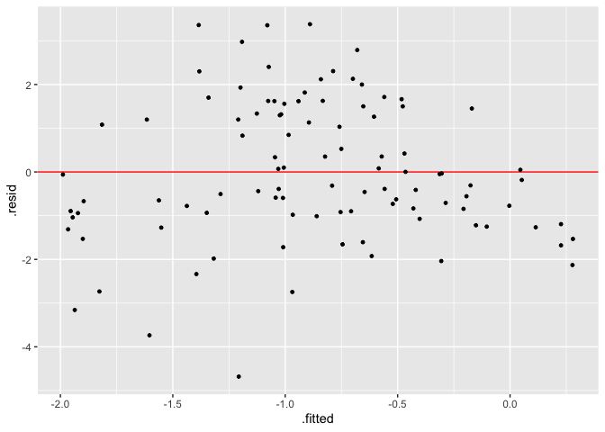
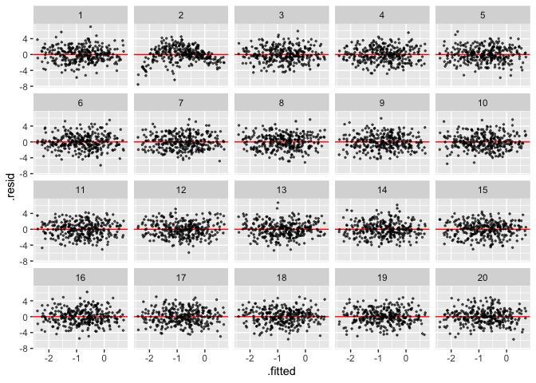
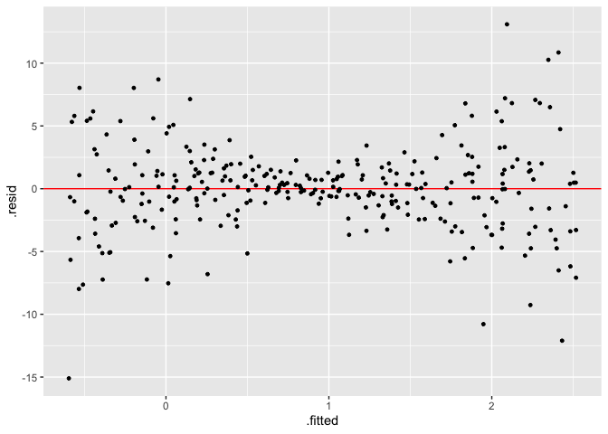
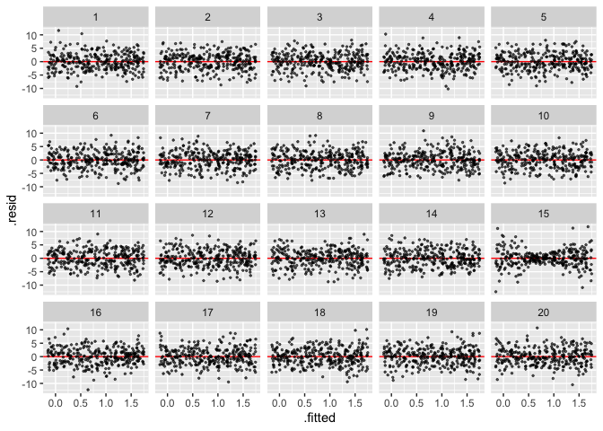

<!-- README.md is generated from README.Rmd. Please edit that file -->

# visage

<!-- badges: start -->

[](https://app.codecov.io/gh/TengMCing/visage?branch=master)
<!-- badges: end -->

The goal of visage is to provide a set of tools for running visual
inference experiments on linear regression models.

## Installation

And the development version from [GitHub](https://github.com/) with:

``` r
# install.packages("remotes")
remotes::install_github("TengMCing/visage")
# remotes::install_url("https://github.com/TengMCing/visage/raw/master/built/visage_0.1.2.tar.gz")
```

``` r
library(visage)
```

## Table of Content

1.  [Visual inference cubic linear model class
    `CUBIC_MODEL`](#1-visual-inference-cubic-linear-model-class-cubic_model)
2.  [Visual inference heteroskedasticity linear model class
    `HETER_MODEL`](#2-visual-inference-heteroskedasticity-linear-model-class-heter_model)
3.  [Closed form expression
    `CLOSED_FORM`](#3-closed-form-expression-closed_form)

## 1. Visual inference cubic linear model class `CUBIC_MODEL`

**1.1. Define a model**

A visual inference cubic linear model is defined as:

``` r
CUBIC_MODEL$formula
#> y ~ 1 + (2 - c) * x + c * z + a * (((2 - c) * x)^2 + (c * z)^2) + 
#>     b * (((2 - c) * x)^3 + (c * z)^3) + e
```

where `x` and `z` are random variables, `a`, `b` and `c` are parameters
and `e` is the random error term.

`cubic_model()` is a cubic model class constructor, which takes
arguments `a`, `b`, `c`, `sigma`, `x` and `z`, where the first four are
numeric values defined above, and `x` and `z` are random variable
instances created by the random variable abstract base class constructor
`rand_var()`. If we would like `x` and `z` to be uniform random
variables ranged from −1 to 1, it can be achieved by using the uniform
random variable class constructor `rand_uniform()`. It only takes two
arguments which are the lower bound and the upper bound of the support.

``` r
mod <- cubic_model(a = -3, b = -3, c = 1, sigma = 1,
                   x = rand_uniform(-1, 1), z = rand_uniform(-1, 1))
mod
#> 
#> ── <CUBIC_MODEL object>
#> y = 1 + (2 - c) * x + c * z + a * (((2 - c) * x)^2 + (c * z)^2) + b * (((2 - c) * x)^3 + (c * z)^3) + e
#>  - x: <RAND_UNIFORM object>
#>    [a: -1, b: 1]
#>  - z: <RAND_UNIFORM object>
#>    [a: -1, b: 1]
#>  - e: <RAND_NORMAL object>
#>    [mu: 0, sigma: 1]
#> Parameters:
#>  - a: -3
#>  - b: -3
#>  - c: 1
#>  - sigma: 1
```

**1.2. Generate random values from the model**

An instance of cubic model class contains methods of simulating data and
making residual plot. Method `gen()` returns a data frame containing
realizations of `x`, `z`, `y` and `e` simulated from the model. The
number of realizations depends on the integer argument `n`. In addition,
a null model will be fitted using the simulated data and residuals and
fitted values will be included in the returned data frame.

The null model is defined as:

``` r
CUBIC_MODEL$null_formula
#> y ~ x + z
```

Generates five realizations from the model:

``` r
mod$gen(n = 5)
#>             y          x          z          e      .resid    .fitted
#> 1  0.21516242  0.3044237  0.3515508 -0.5770481 -0.08375494  0.2989174
#> 2 -1.29530002 -0.2920189 -0.5882554 -0.8064607 -1.15503430 -0.1402657
#> 3 -0.05679982  0.6047610 -0.3570273  0.7020988 -0.46659273  0.4097929
#> 4  1.49700745  0.1992123 -0.7025260  1.5835437  1.35844735  0.1385601
#> 5 -0.03929408 -0.8653997  0.3970407  0.3921720  0.34693464 -0.3862287
```

**1.3. Make a residual plot**

Method `plot()` produce a `ggplot` object. It takes a data frame
containing columns `.resid` and `.fitted` as input, along with a
character argument type indicating the type of the data plot, and other
aesthetic arguments such as size and alpha to control the appearance of
the plot.

``` r
mod$plot(mod$gen(n = 100), type = "resid", size = 1)
```



**1.4. Make a lineup**

A lineup is a matrix of residual plots which can be produced by using
the methods `gen_lineup()` and `plot_lineup()`. Method `gen_lineup()`
takes the number of realizations `n` and the number of plots in a lineup
`k` as inputs. Other than that, the method `plot_lineup()` has the same
user interface as `plot()`.

Generate a lineup consists of 2 plots and 8 realizations:

``` r
mod$gen_lineup(n = 8, k = 2)
#>              y           x          z           e      .resid    .fitted
#> 1   1.13201691  0.25774667  0.1727720  0.05718951  1.00603409  0.1259828
#> 2  -0.84045651  0.17447372 -0.5102047 -1.01497463 -1.17885168  0.3383952
#> 3   1.34391686 -0.05335108  0.2781568  0.42387216  1.76671435 -0.4227975
#> 4  -0.89775710 -0.77687642 -0.9795308  0.32155949  0.04210861 -0.9398657
#> 5  -1.41602383 -0.94138921 -0.4533301 -0.52844407  0.05173736 -1.4677612
#> 6  -3.02800982 -0.82579279  0.8822429  0.66707884 -1.06961706 -1.9583928
#> 7  -1.04956274 -0.86092082 -0.2687812 -0.45213360  0.38326119 -1.4328239
#> 8  -0.59102309  0.43067623  0.1551025 -1.29734353 -1.00138686  0.4103638
#> 9   1.07943579  0.25774667  0.1727720  0.05718951  0.95345297  0.1259828
#> 10  0.82225382  0.17447372 -0.5102047 -1.01497463  0.48385866  0.3383952
#> 11 -0.29410918 -0.05335108  0.2781568  0.42387216  0.12868830 -0.4227975
#> 12 -0.09230039 -0.77687642 -0.9795308  0.32155949  0.84756532 -0.9398657
#> 13 -1.35103053 -0.94138921 -0.4533301 -0.52844407  0.11673066 -1.4677612
#> 14 -1.24032172 -0.82579279  0.8822429  0.66707884  0.71807104 -1.9583928
#> 15 -3.31964345 -0.86092082 -0.2687812 -0.45213360 -1.88681952 -1.4328239
#> 16 -0.95118366  0.43067623  0.1551025 -1.29734353 -1.36154743  0.4103638
#>    test_name statistic   p_value k  null
#> 1     F-test   16.0826 0.1846342 1 FALSE
#> 2     F-test   16.0826 0.1846342 1 FALSE
#> 3     F-test   16.0826 0.1846342 1 FALSE
#> 4     F-test   16.0826 0.1846342 1 FALSE
#> 5     F-test   16.0826 0.1846342 1 FALSE
#> 6     F-test   16.0826 0.1846342 1 FALSE
#> 7     F-test   16.0826 0.1846342 1 FALSE
#> 8     F-test   16.0826 0.1846342 1 FALSE
#> 9     F-test   17.7532 0.1759428 2  TRUE
#> 10    F-test   17.7532 0.1759428 2  TRUE
#> 11    F-test   17.7532 0.1759428 2  TRUE
#> 12    F-test   17.7532 0.1759428 2  TRUE
#> 13    F-test   17.7532 0.1759428 2  TRUE
#> 14    F-test   17.7532 0.1759428 2  TRUE
#> 15    F-test   17.7532 0.1759428 2  TRUE
#> 16    F-test   17.7532 0.1759428 2  TRUE
```

Plot a lineup consists of 20 plots and 300 realizations:

``` r
mod$plot_lineup(mod$gen_lineup(n = 300, k = 20), type = "resid", alpha = 0.6)
```



## 2. Visual inference heteroskedasticity linear model class `HETER_MODEL`

A visual inference heteroskedasticity linear model is defined as:

``` r
HETER_MODEL$formula
#> y ~ 1 + x + sqrt(1 + (2 - abs(a)) * (x - a)^2 * b) * e
```

where `x` is random variables, `a`, `b` are parameters and `e` is the
random error term.

Similar to the cubic model, the heteroskedasticity model could be built
by the heteroskedasticity model class constructor `heter_model()`. This
function takes three arguments as inputs, which are `a`, `b` and `x`.
`a` and `b` are numeric parameters defined above. `x` needs to be a
random variable object.

``` r
mod <- heter_model(a = 0, b = 16, x = rand_uniform(-1, 1))

mod
#> 
#> ── <HETER_MODEL object>
#> y = 1 + x + sqrt(1 + (2 - abs(a)) * (x - a)^2 * b) * e
#>  - x: <RAND_UNIFORM object>
#>    [a: -1, b: 1]
#>  - e: <RAND_NORMAL object>
#>    [mu: 0, sigma: 1]
#> Parameters:
#>  - a: 0
#>  - b: 16
```

Since both the cubic model class `CUBIC_MODEL` and the
heteroskedasticity model class `HETER_MODEL` are inherited from the
visual inference model class `VI_MODEL`, heteroskedasticity model object
can be used in a similar way as cubic model object. The following codes
give examples of the use of the object.

``` r
mod$gen(n = 5)
#>           y          x          e     .resid  .fitted
#> 1  1.646463  0.2717599  0.2043167 -0.5431367 2.189600
#> 2  5.049721 -0.2974273  2.2210523  3.4253827 1.624338
#> 3  2.606823  0.4016645  0.4854659  0.2882150 2.318608
#> 4  1.211346 -0.2691949  0.2637745 -0.4410298 1.652376
#> 5 -1.148795 -0.3414325 -0.8309877 -2.7294312 1.580636
```

``` r
mod$plot(mod$gen(n = 300), type = "resid", size = 1)
```



``` r
mod$plot_lineup(mod$gen_lineup(n = 300), alpha = 0.6)
```



## 3. Closed form expression `CLOSED_FORM`

**3.1. Define and evaluate a closed form expression**

“Closed form expression” is defined as a special type of `R` expression
that can replace random variables in the expression with their
realizations before evaluation. This may sound confusing, so let’s look
at some examples.

`closed_form()` is the closed form expression constructor, which takes
only one arguments `expr` required to be a formula. Considering the
simplest case first, where the expression contains zero random
variables, such as `1 + 3`. It can be evaluated using the method
`compute()` directly as a typical `R` expression.

``` r
cf <- closed_form(~1 + 3)
cf
#> 
#> ── <CLOSED_FORM object>
#> EXPR = 1 + 3
cf$compute()
#> [1] 4
```

However, if the closed form expression contains any random variables, it
can not be evaluated directly since the values of random variables are
unknown. In the following example, `x` is a uniform random variable
ranged from -1 to 1, and `x + 1` is an expression that can not be
evaluated by method `compute()`.

``` r
x <- rand_uniform(-1, 1)
cf <- closed_form(~1 + x)
```

In this case, the `gen()` method will try to generate `n` realizations
from random variables, then evaluate the expression. In addition, if
`rhs_val = TRUE`, realizations generated from random variables will be
returned.

``` r
cf$gen(n = 5, rhs_val = TRUE)
#> $lhs
#> [1] 1.5457301 0.2943149 0.3015830 0.9379620 1.2245546
#> 
#> $rhs
#> $rhs$x
#> [1]  0.54573012 -0.70568513 -0.69841700 -0.06203798  0.22455463
```

**3.2. Nested closed form expression**

Nested closed form expression is useful when a hierarchical structure
present in the expression.

Consider the following statistical model:

`y = x + e`, where `x` is a uniform random variable ranged from -1 to 1,
and `e = 1 + x^2 * z`, where `z` is a standard normal random variable.

We can define this model using the following code:

``` r
z <- rand_normal(mu = 0, sigma = 1)
x <- rand_uniform(-1, 1)
e <- closed_form(~1 + x^2 * z)
y <- closed_form(~x + e)
y
#> 
#> ── <CLOSED_FORM object>
#> EXPR = x + e
#>  - x: <RAND_UNIFORM object>
#>    [a: -1, b: 1]
#>  - e: <CLOSED_FORM object>
#>    EXPR = 1 + x^2 * z
#>     - x: <RAND_UNIFORM object>
#>       [a: -1, b: 1]
#>     - z: <RAND_NORMAL object>
#>       [mu: 0, sigma: 1]
```

Note that `y` depends on `e` and `e` itself is a closed form expression.
Both `y` and `e` depend on `x`. The method `gen()` will return values of
`x`, `z` and `e` if `rhs_val = TRUE`.

``` r
y$gen(n = 5, rhs_val = TRUE)
#> $lhs
#> [1] 1.1474987 1.4635396 0.7027436 1.1855472 0.8148636
#> 
#> $rhs
#> $rhs$x
#> [1]  0.1612635  0.4645366 -0.2404316  0.1408382 -0.2830936
#> 
#> $rhs$z
#> [1] -0.529294784 -0.004620252 -0.983001235  2.254000284  1.222295999
#> 
#> $rhs$e
#> [1] 0.9862352 0.9990030 0.9431753 1.0447090 1.0979572
```

**3.3. Turn `gen()` result into dataframe via method `as_dataframe()`**

Results of `gen()` is either a vector or a list, which can be converted
into a dataframe via method `as_dataframe()`. The `lhs` argument is for
naming the left hand side result of the closed form expression.

``` r
y$as_dataframe(y$gen(n = 5, rhs_val = TRUE), lhs = "y")
#>            y          x          z         e
#> 1  0.6161044 -0.2916790 -1.0839234 0.9077834
#> 2  1.2954322  0.2510535  0.7041138 1.0443788
#> 3  1.2268052 -0.8636601  1.4619284 2.0904654
#> 4 -0.4685280 -0.8773207 -0.7681094 0.4087927
#> 5  1.2053441  0.1708320  1.1825894 1.0345122
```

**3.4. Current limitiation of `CLOSED_FORM`**

For `closed_form()`, any simple expressions can be provided, as long as
all the symbols exist in the current environment. Note that this
function tries to evaluate **ALL** the atomic symbols in the expression
during initialization, and store the values in the object. Hence, calls
like `a$b` will also be decomposed as `$`, `a` and `b`, where `b` will
be interpreted as a variable `b` exists in the current environment.
Therefore, use `~a[["b"]]` instead of `~a$b`. And pre-define function
like `myfun = function() 1`, then use it in the expression `~myfun()`.
