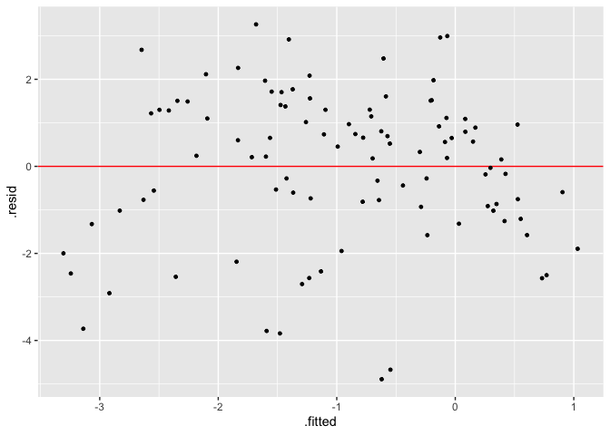

<!-- README.md is generated from README.Rmd. Please edit that file -->

# visage

<!-- badges: start -->
<!-- badges: end -->

The goal of visage is to provide an lightweight OOP system and a set of
tools for running visual inference experiments.

## Installation

And the development version from [GitHub](https://github.com/) with:

``` r
# install.packages("devtools")
devtools::install_github("TengMCing/visage")
```

``` r
library(visage)
```

## Usage of visual inference cubic linear model class `CUBIC_MODEL`

### Define a model

A visual inference cubic linear model is defined as:

``` r
CUBIC_MODEL$formula
#> y ~ 1 + (2 - c) * x + c * z + a * (((2 - c) * x)^2 + (c * z)^2) + 
#>     b * (((2 - c) * x)^3 + (c * z)^3) + e
```

where `x` and `z` are random variables, `a`, `b` and `c` are parameters
and `e` is the random error term.

`cubic_model()` is a cubic model class constructor, which takes
arguments `a`, `b`, `c`, `sigma`, `x` and `z`, where the first four are
numeric values defined above, and `x` and `z` are random variable
instances created by the random variable abstract base class constructor
`rand_var()`. If we would like `x` and `z` to be random uniform
variables ranged from −1 to 1, it can be achieved by using the random
uniform variable class constructor `rand_uniform()`. It only takes two
arguments which are the lower bound and the upper bound of the support.

``` r
mod <- cubic_model(a = -3, b = -3, c = 1, sigma = 1,
                   x = rand_uniform(-1, 1), z = rand_uniform(-1, 1))
mod
#> 
#> ── <CUBIC_MODEL object>
#> y = 1 + (2 - c) * x + c * z + a * (((2 - c) * x)^2 + (c * z)^2) + b * (((2 - c) * x)^3 + (c * z)^3) + e
#>  - x: <RAND_UNIFORM object>
#>    [a: -1, b: 1]
#>  - z: <RAND_UNIFORM object>
#>    [a: -1, b: 1]
#>  - e: <RAND_NORMAL object>
#>    [mu: 0, sigma: 1]
#>  - a: -3
#>  - b: -3
#>  - c: 1
#>  - sigma: 1
```

### Generate random values from the model

An instance of cubic model class contains methods of simulating data and
making residual plot. Method `gen()` returns a data frame containing
realizations of `x`, `z`, `y` and `e` simulated from the model. The
number of realizations depends on the integer argument `n`. In addition,
a null model will be fitted using the simulated data and residuals and
fitted values will be included in the returned data frame.

The null model is defined as:

``` r
CUBIC_MODEL$null_formula
#> y ~ x + z
```

Generates five realizations from the model:

``` r
mod$gen(n = 5)
#>            y          x          z          e     .resid    .fitted
#> 1  1.0613876 -0.1107845 -0.7539074  1.3784398 -0.8368017  1.8981894
#> 2 -3.2118521 -0.7371329 -0.6291890 -1.9766433 -0.6824046 -2.5294475
#> 3  1.4546219 -0.3251719 -0.7376103  2.1597407  0.9189643  0.5356576
#> 4 -2.6604070  0.6402103  0.7713762  0.1068410 -0.1601168 -2.5002902
#> 5 -0.5946423 -0.2556659 -0.3404770 -0.6231745  0.7603589 -1.3550012
```

### Make a residual plot

Method `plot()` produce a `ggplot` object. It takes a data frame
containing columns `.resid` and `.fitted` as input, along with a
character argument type indicating the type of the data plot, and other
aesthetic arguments such as size and alpha to control the appearance of
the plot.

``` r
mod$plot(mod$gen(n = 100), type = "resid", size = 1)
```



### Make a lineup

A lineup is a matrix of residual plots which can be produced by using
the methods `gen_lineup()` and `plot_lineup()`. Method `gen_lineup()`
takes the number of realizations `n` and the number of plots in a lineup
`k` as inputs. Other than that, the method `plot_lineup()` has the same
user interface as `plot()`.

Generate a lineup consists of 2 plots and 8 realizations:

``` r
mod$gen_lineup(n = 8, k = 2)
#>              y          x          z          e      .resid     .fitted
#> 1   0.14562835 -0.5489958 -0.5874978  1.1170449  0.11862208  0.02700628
#> 2   1.55690021  0.1053624  0.0508592  0.4456459  1.61404909 -0.05714887
#> 3   0.75810719 -0.8106785 -0.3978757  1.6258854  1.14524086 -0.38713367
#> 4  -1.15884997  0.1957611  0.3338989 -2.1048936 -0.89395864 -0.26489133
#> 5   0.93611852  0.3812747  0.2947242  0.1998975  1.00328710 -0.06716858
#> 6  -2.69111327 -0.6691253  0.7683535 -0.2139824 -1.25096269 -1.44015058
#> 7  -0.67401497  0.1903347 -0.8487360 -0.5593555 -1.59480611  0.92079114
#> 8  -0.35278613 -0.5828407 -0.3794070  0.3025953 -0.14147168 -0.21131445
#> 9   1.26133364 -0.5489958 -0.5874978  1.1170449  1.23432737  0.02700628
#> 10  0.04119654  0.1053624  0.0508592  0.4456459  0.09834541 -0.05714887
#> 11  0.64771333 -0.8106785 -0.3978757  1.6258854  1.03484700 -0.38713367
#> 12  1.28435882  0.1957611  0.3338989 -2.1048936  1.54925015 -0.26489133
#> 13 -0.18262272  0.3812747  0.2947242  0.1998975 -0.11545414 -0.06716858
#> 14 -2.70141914 -0.6691253  0.7683535 -0.2139824 -1.26126857 -1.44015058
#> 15 -0.47274268  0.1903347 -0.8487360 -0.5593555 -1.39353382  0.92079114
#> 16 -1.35782785 -0.5828407 -0.3794070  0.3025953 -1.14651340 -0.21131445
#>    test_name statistic   p_value k  null
#> 1     F-test 2.8965928 0.4116084 2 FALSE
#> 2     F-test 2.8965928 0.4116084 2 FALSE
#> 3     F-test 2.8965928 0.4116084 2 FALSE
#> 4     F-test 2.8965928 0.4116084 2 FALSE
#> 5     F-test 2.8965928 0.4116084 2 FALSE
#> 6     F-test 2.8965928 0.4116084 2 FALSE
#> 7     F-test 2.8965928 0.4116084 2 FALSE
#> 8     F-test 2.8965928 0.4116084 2 FALSE
#> 9     F-test 0.4075755 0.8076774 1  TRUE
#> 10    F-test 0.4075755 0.8076774 1  TRUE
#> 11    F-test 0.4075755 0.8076774 1  TRUE
#> 12    F-test 0.4075755 0.8076774 1  TRUE
#> 13    F-test 0.4075755 0.8076774 1  TRUE
#> 14    F-test 0.4075755 0.8076774 1  TRUE
#> 15    F-test 0.4075755 0.8076774 1  TRUE
#> 16    F-test 0.4075755 0.8076774 1  TRUE
```

Plot a lineup consists of 20 plots and 300 realizations:

``` r
mod$plot_lineup(mod$gen_lineup(n = 300, k = 20), type = "resid", alpha = 0.6)
```


## Usage of visual inference heteroskedasticity linear model class `HETER_MODEL`

A visual inference heteroskedasticity linear model is defined as:

``` r
HETER_MODEL$formula
#> y ~ 1 + x + sqrt(1 + (2 - abs(a)) * (x - a)^2 * b) * e
```

where `x` is random variables, `a`, `b` are parameters and `e` is the
random error term.

Similar to the cubic model, the heteroskedasticity model could be built
by the heteroskedasticity model class constructor `heter_model()`. This
function takes three arguments as inputs, which are `a`, `b` and `x`.
`a` and `b` are numeric parameters defined above. `x` needs to be a
random variable object.

``` r
mod <- heter_model(a = 0, b = 16, x = rand_uniform(-1, 1))

mod
#> 
#> ── <HETER_MODEL object>
#> y = 1 + x + sqrt(1 + (2 - abs(a)) * (x - a)^2 * b) * e
#>  - x: <RAND_UNIFORM object>
#>    [a: -1, b: 1]
#>  - e: <RAND_NORMAL object>
#>    [mu: 0, sigma: 1]
#>  - a: 0
#>  - b: 16
```

Since both the cubic model class `CUBIC_MODEL` and the
heteroskedasticity model class `HETER_MODEL` are inherited from the
visual inference model class `VI_MODEL`, heteroskedasticity model object
can be used in a similar way as cubic model object. The following codes
give examples of the use of the object.

``` r
mod$gen(n = 5)
#>            y          x          e      .resid  .fitted
#> 1 -0.8769162 -0.7975877 -0.2335537 -2.39244007 1.515524
#> 2  3.9592432 -0.3695783  1.4363827  2.69688816 1.262355
#> 3 -0.8342639 -0.3834641 -0.6073838 -2.10483244 1.270569
#> 4  1.3183645 -0.3888679  0.2926803  0.04459969 1.273765
#> 5  3.3726651 -0.9689421  0.5997530  1.75578466 1.616880
```

``` r
mod$plot(mod$gen(n = 300), type = "resid", size = 1)
```


``` r
mod$plot_lineup(mod$gen_lineup(n = 300), alpha = 0.6)
```


## Basic usgae of `visage` OOP system

### Define a new class

A class can be defined with the `new_class` function. All positional
arguments are for specifying parent classes, `BASE` is the base object
class provided by the package, you don’t need to manually specify it.
But if you would like to have advanced behaviour, you can try to
implement your own `object` class.

Class name is mandatory and should be unique.

``` r
# You don't actually need to specify BASE here. This is only for demonstration.
DEMO <- new_class(BASE, class_name = "DEMO")
DEMO
#> 
#> ── <DEMO class>
```

The object is an environment containing some useful attributes and
methods.

-   `OBJECT$..type..` gives the current class name.
-   `OBJECT$..class..` gives the current class name and parent class
    names.

``` r
DEMO$..type..
#> [1] "DEMO"
DEMO$..class..
#> [1] "DEMO" "BASE"
```

-   `OBJECT$..dict..()` returns all names of attribute and method of the
    object.
-   `OBJECT$..methods..()` returns all names of method of the object

``` r
DEMO$..dict..()
#>  [1] "..dict.."         "..str.."          "..len.."          "..class.."       
#>  [5] "..new.."          "..repr.."         "has_attr"         "instantiation"   
#>  [9] "set_attr"         "..type.."         "get_attr"         "..methods.."     
#> [13] "..method_env.."   "..instantiated.." "..init.."
DEMO$..methods..()
#>  [1] "..dict.."      "..str.."       "..len.."       "..new.."      
#>  [5] "..repr.."      "has_attr"      "instantiation" "set_attr"     
#>  [9] "get_attr"      "..methods.."   "..init.."
```

-   `OBJECT$..str..()` returns a string representation of the object,
    which will be used by the S3 `print()` method. This method usually
    needs to be overridden in subclass to give short summary of the
    object.

``` r
DEMO$..str..()
#> [1] "<DEMO class>"
```

### Register a method for the class

Methods can be registered by using `register_method()`. The first
argument is the object you want to bind the function to, the rest of the
positional arguments are for specifying method names and functions. The
syntax is `method_name = function`.

You can choose to write inline function or pass pre-defined function.
The associative environment of the function doesn’t matter, it will be
modified by the `register_method()` function.

``` r
pre_defined_fn <- function() 1 + 2

register_method(DEMO, inline_fn = function() 1 + 1, pre_defined_fn = pre_defined_fn)

DEMO$inline_fn()
#> [1] 2
DEMO$pre_defined_fn()
#> [1] 3
```

For method that needs to access the object itself, just simply use
`self` in your method. It is an reference to the object.

``` r
DEMO$val <- 5

register_method(DEMO, get_val = function() self$val)

DEMO$get_val()
#> [1] 5
```

### Override the `..init..()` method

`..init..()` method is for instance initialization. To override the
`..init..()` method, you need to use the `register_method()` to register
it again.

``` r
init <- function(first_name, employee_id) {
  self$first_name <- first_name
  self$employee_id <- employee_id
}

register_method(DEMO, ..init.. = init)
```

Now the class requires two two arguments `first_name` and `employee_id`
to initialize the instance.

### Build an instance

To new and initialize an instance, you need to use the `instantiation()`
method. The output will show it is an object.

``` r
mike <- DEMO$instantiation("Mike", 25)
mike
#> 
#> ── <DEMO object>
```

`first_name` and `employee_id` are stored in the object because of the
`..init..()` method.

``` r
mike$first_name
#> [1] "Mike"
mike$employee_id
#> [1] 25
```

### A complete workflow

It is recommend to write your class definition in a function to make
debugging easier. The following example new a class `DEMO_2`, defines
its own `..init..()` method, defines a `get_email()` function for
retrieving the email address, defines its own `..str..()` method such
that when we print the object, it will provide us with a nicely
formatted summary.

`use_method` is used to run methods from other classes, which in this
case, the `..str..()` method from the `BASE` class.

``` r
class_DEMO_2 <- function(env = new.env(parent = parent.frame())) {
  
  new_class(env = env, class_name = "DEMO_2")
  
  init_ <- function(first_name, employee_id) {
    self$first_name <- first_name
    self$employee_id <- employee_id
  }
  
  get_email_ <- function() {
    paste0(self$first_name, "_", self$employee_id, "@company.com")
  }
  
  str_ <- function() {
    paste(use_method(self, BASE$..str..)(), 
          paste("Name:", self$first_name,
                "\nEmployee ID:", self$employee_id,
                "\nEmail:", self$get_email()), 
          sep = "\n")
  }
  
  register_method(env,
                  ..init.. = init_,
                  get_email = get_email_,
                  ..str.. = str_)
  
  return(env)
}
```

``` r
DEMO_2 <- class_DEMO_2()
mike <- DEMO_2$instantiation("Mike", 25)
mike$get_email()
#> [1] "Mike_25@company.com"
```

``` r
mike$..str..()
#> [1] "<DEMO_2 object>\nName: Mike \nEmployee ID: 25 \nEmail: Mike_25@company.com"
mike
#> 
#> ── <DEMO_2 object>
#> Name: Mike 
#> Employee ID: 25 
#> Email: Mike_25@company.com
```
