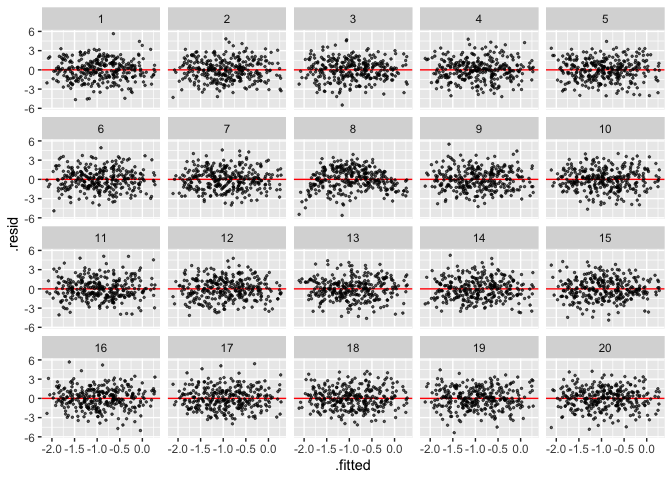
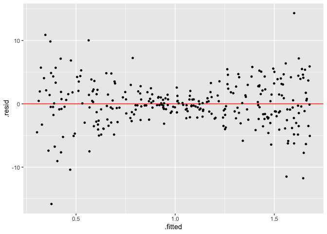

<!-- README.md is generated from README.Rmd. Please edit that file -->

# visage

<!-- badges: start -->

[](https://app.codecov.io/gh/TengMCing/visage?branch=master)
<!-- badges: end -->

The goal of visage is to provide a set of tools for running visual
inference experiments on linear regression models.

## Installation

And the development version from [GitHub](https://github.com/) with:

``` r
# install.packages("remotes")
remotes::install_url("https://github.com/TengMCing/visage/raw/master/built/visage_0.1.0.tar.gz")
```

``` r
library(visage)
```

## Table of Content

1.  [Visual inference cubic linear model class
    `CUBIC_MODEL`](#1-visual-inference-cubic-linear-model-class-cubic_model)
2.  [Visual inference heteroskedasticity linear model class
    `HETER_MODEL`](#2-visual-inference-heteroskedasticity-linear-model-class-heter_model)
3.  [Closed form expression
    `CLOSED_FORM`](#3-closed-form-expression-closed_form)

## 1. Visual inference cubic linear model class `CUBIC_MODEL`

**1.1. Define a model**

A visual inference cubic linear model is defined as:

``` r
CUBIC_MODEL$formula
#> y ~ 1 + (2 - c) * x + c * z + a * (((2 - c) * x)^2 + (c * z)^2) + 
#>     b * (((2 - c) * x)^3 + (c * z)^3) + e
```

where `x` and `z` are random variables, `a`, `b` and `c` are parameters
and `e` is the random error term.

`cubic_model()` is a cubic model class constructor, which takes
arguments `a`, `b`, `c`, `sigma`, `x` and `z`, where the first four are
numeric values defined above, and `x` and `z` are random variable
instances created by the random variable abstract base class constructor
`rand_var()`. If we would like `x` and `z` to be uniform random
variables ranged from −1 to 1, it can be achieved by using the uniform
random variable class constructor `rand_uniform()`. It only takes two
arguments which are the lower bound and the upper bound of the support.

``` r
mod <- cubic_model(a = -3, b = -3, c = 1, sigma = 1,
                   x = rand_uniform(-1, 1), z = rand_uniform(-1, 1))
mod
#> 
#> ── <CUBIC_MODEL object>
#> y = 1 + (2 - c) * x + c * z + a * (((2 - c) * x)^2 + (c * z)^2) + b * (((2 - c) * x)^3 + (c * z)^3) + e
#>  - x: <RAND_UNIFORM object>
#>    [a: -1, b: 1]
#>  - z: <RAND_UNIFORM object>
#>    [a: -1, b: 1]
#>  - e: <RAND_NORMAL object>
#>    [mu: 0, sigma: 1]
#> Parameters:
#>  - a: -3
#>  - b: -3
#>  - c: 1
#>  - sigma: 1
```

**1.2. Generate random values from the model**

An instance of cubic model class contains methods of simulating data and
making residual plot. Method `gen()` returns a data frame containing
realizations of `x`, `z`, `y` and `e` simulated from the model. The
number of realizations depends on the integer argument `n`. In addition,
a null model will be fitted using the simulated data and residuals and
fitted values will be included in the returned data frame.

The null model is defined as:

``` r
CUBIC_MODEL$null_formula
#> y ~ x + z
```

Generates five realizations from the model:

``` r
mod$gen(n = 5)
#>            y          x          z           e     .resid    .fitted
#> 1 -4.6642862  0.9566625 -0.5212399 -0.33725359 -1.8092145 -2.8550717
#> 2 -0.3454638  0.6679040  0.2980351  0.26662555  0.5503441 -0.8958079
#> 3 -0.1475324 -0.2525023 -0.8917560  0.39793762 -0.9455994  0.7980670
#> 4 -0.2839915  0.3731374 -0.8566907  0.08864603  0.9956816 -1.2796731
#> 5 -0.9782251  0.6228871 -0.9077765  0.42364073  1.2087882 -2.1870133
```

**1.3. Make a residual plot**

Method `plot()` produce a `ggplot` object. It takes a data frame
containing columns `.resid` and `.fitted` as input, along with a
character argument type indicating the type of the data plot, and other
aesthetic arguments such as size and alpha to control the appearance of
the plot.

``` r
mod$plot(mod$gen(n = 100), type = "resid", size = 1)
```


**1.4. Make a lineup**

A lineup is a matrix of residual plots which can be produced by using
the methods `gen_lineup()` and `plot_lineup()`. Method `gen_lineup()`
takes the number of realizations `n` and the number of plots in a lineup
`k` as inputs. Other than that, the method `plot_lineup()` has the same
user interface as `plot()`.

Generate a lineup consists of 2 plots and 8 realizations:

``` r
mod$gen_lineup(n = 8, k = 2)
#>             y          x            z           e     .resid    .fitted
#> 1  -2.0731250  0.6639641 -0.001229654 -1.53518733 -1.0187631 -1.0543619
#> 2  -3.1739190  0.9718971 -0.231977520  0.79801845 -1.5978166 -1.5761024
#> 3  -1.2638997 -0.6510833 -0.548610223 -0.21291028 -0.3594960 -0.9044037
#> 4   0.3138087  0.3036746  0.447574135 -0.20682682  0.5152735 -0.2014649
#> 5  -0.9588352 -0.9938087 -0.642996876  0.13911850 -0.1589585 -0.7998767
#> 6  -1.1501286 -0.9313476 -0.985159318 -0.01176225  0.1560223 -1.3061508
#> 7  -1.2663724 -0.4701171 -0.641952970 -0.36031661 -0.1126522 -1.1537202
#> 8   1.0754090  0.6882399 -0.318498674  2.31209231  2.5763907 -1.5009817
#> 9  -0.1628888  0.6639641 -0.001229654 -1.53518733  0.8914731 -1.0543619
#> 10 -2.9753329  0.9718971 -0.231977520  0.79801845 -1.3992305 -1.5761024
#> 11 -1.2846643 -0.6510833 -0.548610223 -0.21291028 -0.3802606 -0.9044037
#> 12  0.3167032  0.3036746  0.447574135 -0.20682682  0.5181680 -0.2014649
#> 13 -2.4283380 -0.9938087 -0.642996876  0.13911850 -1.6284613 -0.7998767
#> 14  0.7464072 -0.9313476 -0.985159318 -0.01176225  2.0525580 -1.3061508
#> 15 -1.7525570 -0.4701171 -0.641952970 -0.36031661 -0.5988368 -1.1537202
#> 16 -0.9563916  0.6882399 -0.318498674  2.31209231  0.5445901 -1.5009817
#>    test_name statistic   p_value k  null
#> 1     F-test  2.123557 0.4697207 1 FALSE
#> 2     F-test  2.123557 0.4697207 1 FALSE
#> 3     F-test  2.123557 0.4697207 1 FALSE
#> 4     F-test  2.123557 0.4697207 1 FALSE
#> 5     F-test  2.123557 0.4697207 1 FALSE
#> 6     F-test  2.123557 0.4697207 1 FALSE
#> 7     F-test  2.123557 0.4697207 1 FALSE
#> 8     F-test  2.123557 0.4697207 1 FALSE
#> 9     F-test  3.919170 0.3599713 2  TRUE
#> 10    F-test  3.919170 0.3599713 2  TRUE
#> 11    F-test  3.919170 0.3599713 2  TRUE
#> 12    F-test  3.919170 0.3599713 2  TRUE
#> 13    F-test  3.919170 0.3599713 2  TRUE
#> 14    F-test  3.919170 0.3599713 2  TRUE
#> 15    F-test  3.919170 0.3599713 2  TRUE
#> 16    F-test  3.919170 0.3599713 2  TRUE
```

Plot a lineup consists of 20 plots and 300 realizations:

``` r
mod$plot_lineup(mod$gen_lineup(n = 300, k = 20), type = "resid", alpha = 0.6)
```



## 2. Visual inference heteroskedasticity linear model class `HETER_MODEL`

A visual inference heteroskedasticity linear model is defined as:

``` r
HETER_MODEL$formula
#> y ~ 1 + x + sqrt(1 + (2 - abs(a)) * (x - a)^2 * b) * e
```

where `x` is random variables, `a`, `b` are parameters and `e` is the
random error term.

Similar to the cubic model, the heteroskedasticity model could be built
by the heteroskedasticity model class constructor `heter_model()`. This
function takes three arguments as inputs, which are `a`, `b` and `x`.
`a` and `b` are numeric parameters defined above. `x` needs to be a
random variable object.

``` r
mod <- heter_model(a = 0, b = 16, x = rand_uniform(-1, 1))

mod
#> 
#> ── <HETER_MODEL object>
#> y = 1 + x + sqrt(1 + (2 - abs(a)) * (x - a)^2 * b) * e
#>  - x: <RAND_UNIFORM object>
#>    [a: -1, b: 1]
#>  - e: <RAND_NORMAL object>
#>    [mu: 0, sigma: 1]
#> Parameters:
#>  - a: 0
#>  - b: 16
```

Since both the cubic model class `CUBIC_MODEL` and the
heteroskedasticity model class `HETER_MODEL` are inherited from the
visual inference model class `VI_MODEL`, heteroskedasticity model object
can be used in a similar way as cubic model object. The following codes
give examples of the use of the object.

``` r
mod$gen(n = 5)
#>           y           x          e      .resid   .fitted
#> 1 1.2372740 -0.01168696 0.24841870 -1.36946686 2.6067409
#> 2 5.2544224  0.67213061 0.91118823  0.80470718 4.4497152
#> 3 3.3506552  0.24579463 1.22898498  0.04996907 3.3006861
#> 4 1.0081627 -0.93212743 0.17520187  0.88212459 0.1260381
#> 5 0.4139335 -0.68901101 0.02558343 -0.36733398 0.7812674
```

``` r
mod$plot(mod$gen(n = 300), type = "resid", size = 1)
```



``` r
mod$plot_lineup(mod$gen_lineup(n = 300), alpha = 0.6)
```


## 3. Closed form expression `CLOSED_FORM`

**3.1. Define and evaluate a closed form expression**

“Closed form expression” is defined as a special type of `R` expression
that can replace random variables in the expression with their
realizations before evaluation. This may sound confusing, so let’s look
at some examples.

`closed_form()` is the closed form expression constructor, which takes
only one arguments `expr` required to be a formula. Considering the
simplest case first, where the expression contains zero random
variables, such as `1 + 3`. It can be evaluated using the method
`compute()` directly as a typical `R` expression.

``` r
cf <- closed_form(~1 + 3)
cf
#> 
#> ── <CLOSED_FORM object>
#> EXPR = 1 + 3
cf$compute()
#> [1] 4
```

However, if the closed form expression contains any random variables, it
can not be evaluated directly since the values of random variables are
unknown. In the following example, `x` is a uniform random variable
ranged from -1 to 1, and `x + 1` is an expression that can not be
evaluated by method `compute()`.

``` r
x <- rand_uniform(-1, 1)
cf <- closed_form(~1 + x)
```

In this case, the `gen()` method will try to generate `n` realizations
from random variables, then evaluate the expression. In addition, if
`rhs_val = TRUE`, realizations generated from random variables will be
returned.

``` r
cf$gen(n = 5, rhs_val = TRUE)
#> $lhs
#> [1] 1.4380714 1.0621618 0.3475848 0.6295953 1.7880562
#> 
#> $rhs
#> $rhs$x
#> [1]  0.43807142  0.06216181 -0.65241520 -0.37040467  0.78805621
```

**3.2. Nested closed form expression**

Nested closed form expression is useful when a hierarchical structure
present in the expression.

Consider the following statistical model:

`y = x + e`, where `x` is a uniform random variable ranged from -1 to 1,
and `e = 1 + x^2 * z`, where `z` is a standard normal random variable.

We can define this model using the following code:

``` r
z <- rand_normal(mu = 0, sigma = 1)
x <- rand_uniform(-1, 1)
e <- closed_form(~1 + x^2 * z)
y <- closed_form(~x + e)
y
#> 
#> ── <CLOSED_FORM object>
#> EXPR = x + e
#>  - x: <RAND_UNIFORM object>
#>    [a: -1, b: 1]
#>  - e: <CLOSED_FORM object>
#>    EXPR = 1 + x^2 * z
#>     - x: <RAND_UNIFORM object>
#>       [a: -1, b: 1]
#>     - z: <RAND_NORMAL object>
#>       [mu: 0, sigma: 1]
```

Note that `y` depends on `e` and `e` itself is a closed form expression.
Both `y` and `e` depend on `x`. The method `gen()` will return values of
`x`, `z` and `e` if `rhs_val = TRUE`.

``` r
y$gen(n = 5, rhs_val = TRUE)
#> $lhs
#> [1] 0.7669146 0.9233197 1.1509608 1.1625842 1.0457129
#> 
#> $rhs
#> $rhs$x
#> [1] -0.22046378 -0.06867940  0.14701180  0.32966808  0.04621975
#> 
#> $rhs$z
#> [1] -0.2596807 -1.6962257  0.1827199 -1.5373788 -0.2372567
#> 
#> $rhs$e
#> [1] 0.9873784 0.9919991 1.0039490 0.8329161 0.9994932
```

**3.3. Turn `gen()` result into dataframe via method `as_dataframe()`**

Results of `gen()` is either a vector or a list, which can be converted
into a dataframe via method `as_dataframe()`. The `lhs` argument is for
naming the left hand side result of the closed form expression.

``` r
y$as_dataframe(y$gen(n = 5, rhs_val = TRUE), lhs = "y")
#>          y          x          z        e
#> 1 0.880380 -0.1444586  1.1902570 1.024839
#> 2 1.369657  0.3072558  0.6609818 1.062401
#> 3 1.469948  0.8942250 -0.5305861 0.575723
#> 4 1.439847 -0.8188864  1.8770961 2.258734
#> 5 2.053579  0.6144952  1.1628157 1.439084
```

**3.4. Current limitiation of `CLOSED_FORM`**

For `closed_form()`, any simple expressions can be provided, as long as
all the symbols exist in the current environment. Note that this
function tries to evaluate **ALL** the atomic symbols in the expression
during initialization, and store the values in the object. Hence, calls
like `a$b` will also be decomposed as `$`, `a` and `b`, where `b` will
be interpreted as a variable `b` exists in the current environment.
Therefore, use `~a[["b"]]` instead of `~a$b`. And pre-define function
like `myfun = function() 1`, then use it in the expression `~myfun()`.
